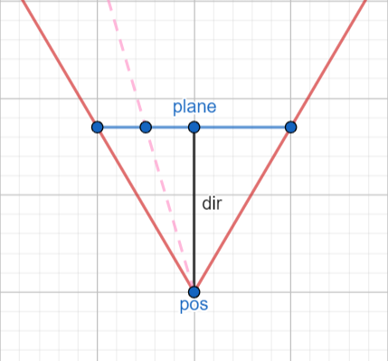

# 3D Raycaster

Welcome to my implementation of a 3D Raycasting Algorithm! This program demonstrates the use of the [DDA raycasting algorithm](https://lodev.org/cgtutor/raycasting.html) to query a 2D world map based on the current position of the player, and draw a 3D representation of that map.

Also included is a small minimap that gives a 2D representation of exactly what the raycasting looks like, as well as where the player is in the world.

---

### Running the program

To run the program from source, follow these simple steps:

1. Open a terminal and clone the repo by running `git clone https://github.com/Shuppin/3D-Raycaster.git` in your terminal.
2. Enter the directory by running `cd 3D-Raycaster`
2. Install the required dependencies by running `pip install -r requirements.txt`. (Depending on your OS, you may need a C compiler installed as well)
3. Finally, run the program by executing `python src/main.py` in your terminal. 

That's it! You should now be able to play with this simple raycaster.

### Controls

The controls follow basic WASD movement keys.

The `X` key will toggle the height of the walls, demonstrating that only a single row of rays are being casted.

### How it works

#### Map
The map is stored as a 2D array of integers, each number either representing an empty space (0), or a colour (1-5)
 
#### Camera

The camera is made up of a position, direction vector and a plane vector.

- (pos)ition is a simple x, y vector and is directly representative of the position on the map (i.e. 0,0 is the top left of the map and mapWidth, mapHeight is the bottom right of the map
- (dir)ection is another x, y vector which represents, you guessed it, the direction of the camera. The magnitude of this vector also represents the focal length
- plane is another x,y vector and that represents the width of the camera plane. The camera plane defines how wide the field of view should be.
 
#### DDA Raycasting Algorithm

I highly recommend watching [this](https://www.youtube.com/watch?v=NbSee-XM7WA) video explaining how the algorithm works.

The DDA Ray casting algorithm is a very an efficient way to render a scene on the screen. Instead of casting a ray for every individual pixel, we cast a ray for each column of pixels. This approach significantly reduces the amount of rays required.

#### 3D Visualisation

As the ray travels, it intersects with the boundaries of a grid. At each intersection, we check the value of the corresponding grid cell. If the value is greater than 0, we know that a wall should be drawn, and its color will be determined by the value of that grid cell. To represent this, we draw a single pixel at the location where the ray intersects the grid boundary.

To create the illusion of depth, we then stretch this pixel vertically based on the distance traveled by the ray. By doing so, we 'render' the walls, providing a visually 3D appearance.
